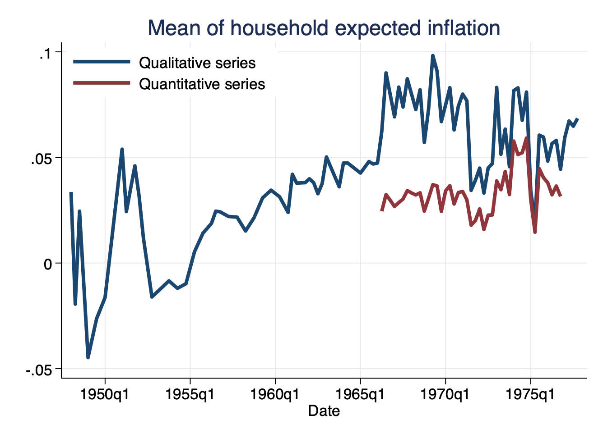
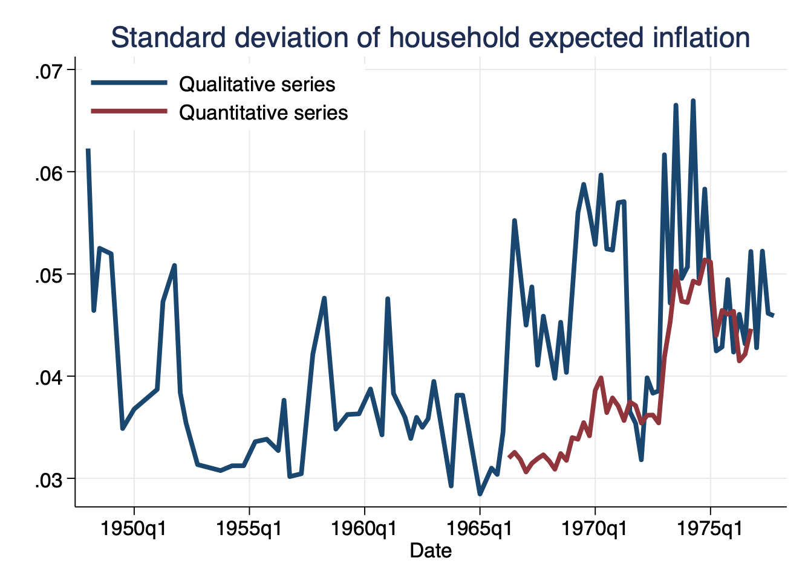
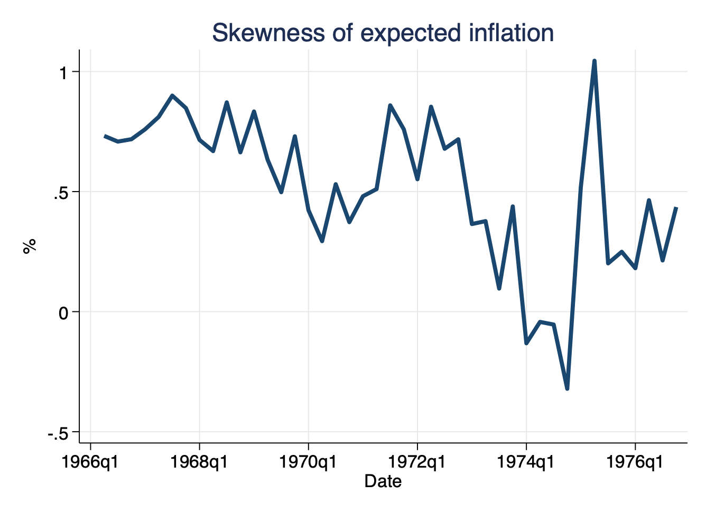

.
# Summary
Measures of expected inflation before the numerical answers to the Michigan survey of consumers were available. This dataset was collated from public sources, so it can be **freely used** by other researchers. The dataset was posted in June of 2024, and will not be updated.

---

# Authors and References:
[Losing the Inflation Anchor](https://personal.lse.ac.uk/reisr/papers/22-loseanchor.pdf) (2022). *Brookings Papers on Economic Activity* 307-361, Fall.
[bibtex](https://personal.lse.ac.uk/reisr/papers/22-loseanchor-bib.bib)
- [Ricardo Reis](https://www.r2rsquared.com/)

[Disagreement About Inflation Expectations](https://personal.lse.ac.uk/reisr/papers/04-disagree.pdf) (2004). *NBER Macroeconomics Annual* 18, 209-248.
[bibtex](https://personal.lse.ac.uk/reisr/papers/04-FPRdisagree-bib.bib)
- [N. Gregory Mankiw](https://scholar.harvard.edu/mankiw/home)
- [Ricardo Reis](https://www.r2rsquared.com/)
- [Justin Wolfers](https://fordschool.umich.edu/faculty/justin-wolfers)

---

# Full Dataset
Quantitative measures 1966q2 - 1976q4
- [Excel](MSCquant.xlsx) (with meta data)
- [csv](MSCquant.csv)
- [dta](MSCquant.dta)

Qualitative measures 1948q1 - 1977q4
- [Excel](MSCqual.xlsx) (with meta data)
- [csv](MSCqual.csv)
- [dta](MSCqual.dta)

---

# Variables
The data is at the quarterly frequency.

**Quantitative data**
<table>
  <tr style="background-color: #d4f4d3;">
    <th style="border: 2px solid #68b684; padding: 8px;">Column</th>
    <th style="border: 2px solid #68b684; padding: 8px;">Description</th>
  </tr>
  <tr style="background-color: #f5f5f5;">
    <td style="border: 2px solid #68b684; padding: 8px;"><code>date</code></td>
    <td style="border: 2px solid #68b684; padding: 8px;">Year / quarter</td>
  </tr>
  <tr style="background-color: #d4f4d3;">
    <td style="border: 2px solid #68b684; padding: 8px;"><code>qual_up</code></td>
    <td style="border: 2px solid #68b684; padding: 8px;">Percentage expecting prices to rise</td>
  </tr>
  <tr style="background-color: #f5f5f5;">
    <td style="border: 2px solid #68b684; padding: 8px;"><code>qual_down</code></td>
    <td style="border: 2px solid #68b684; padding: 8px;">Percentage expecting prices to fall</td>
  </tr>
  <tr style="background-color: #d4f4d3;">
    <td style="border: 2px solid #68b684; padding: 8px;"><code>qual_same</code></td>
    <td style="border: 2px solid #68b684; padding: 8px;">Percentage expecting no price change</td>
  </tr>
  <tr style="background-color: #f5f5f5;">
    <td style="border: 2px solid #68b684; padding: 8px;"><code>mrw_mean</code></td>
    <td style="border: 2px solid #68b684; padding: 8px;">Mankiw-Reis-Wolfers Michigan series of mean expected inflation</td>
  </tr>
  <tr style="background-color: #d4f4d3;">
    <td style="border: 2px solid #68b684; padding: 8px;"><code>mrw_sd</code></td>
    <td style="border: 2px solid #68b684; padding: 8px;">Mankiw-Reis-Wolfers Michigan series of standard deviation of expected inflation</td>
  </tr>
  <tr style="background-color: #f5f5f5;">
    <td style="border: 2px solid #68b684; padding: 8px;"><code>mrw_iqr</code></td>
    <td style="border: 2px solid #68b684; padding: 8px;">Mankiw-Reis-Wolfers Michigan series of iqr of expected inflation</td>
  </tr>
  <tr style="background-color: #d4f4d3;">
    <td style="border: 2px solid #68b684; padding: 8px;"><code>reis_mean</code></td>
    <td style="border: 2px solid #68b684; padding: 8px;">Reis Michigan series of mean of expected inflation</td>
  </tr>
  <tr style="background-color: #f5f5f5;">
    <td style="border: 2px solid #68b684; padding: 8px;"><code>reis_sd</code></td>
    <td style="border: 2px solid #68b684; padding: 8px;">Reis Michigan series of standard deviation of expected inflation</td>
  </tr>
  <tr style="background-color: #d4f4d3;">
    <td style="border: 2px solid #68b684; padding: 8px;"><code>reis_skew</code></td>
    <td style="border: 2px solid #68b684; padding: 8px;">Reis Michigan series of skewness of expected inflation</td>
  </tr>
</table>

**Quanlitative data**
<table>
  <tr style="background-color: #d4f4d3;">
    <th style="border: 2px solid #68b684; padding: 8px;">Column</th>
    <th style="border: 2px solid #68b684; padding: 8px;">Description</th>
  </tr>
  <tr style="background-color: #f5f5f5;">
    <td style="border: 2px solid #68b684; padding: 8px;"><code>date</code></td>
    <td style="border: 2px solid #68b684; padding: 8px;">Year / quarter</td>
  </tr>
  <tr style="background-color: #d4f4d3;">
    <td style="border: 2px solid #68b684; padding: 8px;"><code>downorsame</code></td>
    <td style="border: 2px solid #68b684; padding: 8px;">Percentage expecting prices to fall or stay same</td>
  </tr>
  <tr style="background-color: #f5f5f5;">
    <td style="border: 2px solid #68b684; padding: 8px;"><code>inf_1to2</code></td>
    <td style="border: 2px solid #68b684; padding: 8px;">Percentage expecting prices to rise by 1-2%</td>
  </tr>
  <tr style="background-color: #d4f4d3;">
    <td style="border: 2px solid #68b684; padding: 8px;"><code>inf_3to4</code></td>
    <td style="border: 2px solid #68b684; padding: 8px;">Percentage expecting prices to rise by 3-4%</td>
  </tr>
  <tr style="background-color: #f5f5f5;">
    <td style="border: 2px solid #68b684; padding: 8px;"><code>inf_5</code></td>
    <td style="border: 2px solid #68b684; padding: 8px;">Percentage expecting prices to rise by 5%</td>
  </tr>
  <tr style="background-color: #d4f4d3;">
    <td style="border: 2px solid #68b684; padding: 8px;"><code>inf_6to9</code></td>
    <td style="border: 2px solid #68b684; padding: 8px;">Percentage expecting prices to rise by 6-9%</td>
  </tr>
  <tr style="background-color: #f5f5f5;">
    <td style="border: 2px solid #68b684; padding: 8px;"><code>inf_10to14</code></td>
    <td style="border: 2px solid #68b684; padding: 8px;">Percentage expecting prices to rise by 10-14%</td>
  </tr>
  <tr style="background-color: #d4f4d3;">
    <td style="border: 2px solid #68b684; padding: 8px;"><code>dontknowup</code></td>
    <td style="border: 2px solid #68b684; padding: 8px;">Percentage who don't know how much prices will rise</td>
  </tr>
  <tr style="background-color: #f5f5f5;">
    <td style="border: 2px solid #68b684; padding: 8px;"><code>dontknow</code></td>
    <td style="border: 2px solid #68b684; padding: 8px;">Percentage who don't know if prices will fall</td>
  </tr>
  <tr style="background-color: #d4f4d3;">
    <td style="border: 2px solid #68b684; padding: 8px;"><code>reis_mean</code></td>
    <td style="border: 2px solid #68b684; padding: 8px;">Reis Michigan series of mean of expected inflation</td>
  </tr>
  <tr style="background-color: #f5f5f5;">
    <td style="border: 2px solid #68b684; padding: 8px;"><code>reis_sd</code></td>
    <td style="border: 2px solid #68b684; padding: 8px;">Reis Michigan series of standard deviation of expected inflation</td>
  </tr>
  <tr style="background-color: #fd4f4d3;">
    <td style="border: 2px solid #68b684; padding: 8px;"><code>reis_skew</code></td>
    <td style="border: 2px solid #68b684; padding: 8px;">Reis Michigan series of skewness of expected inflation</td>
  </tr>
</table>

---

# Figures

## Qualitative and quantitative mean expected inflation by households

Data for replication: [Excel](mrw_mean.xls), [csv](mrw_mean.csv), [dta](mrw_mean.dta) 

---

## Qualitative and quantitative disagreement about expected inflation by households

Data for replication: [Excel](mrw_sd.xls), [csv](mrw_sd.csv), [dta](mrw_sd.dta) 

---

## Quantitative disagreement about expected inflation by households

Data for replication: [Excel](reis_skew.xls), [csv](reis_skew.csv), [dta](reis_skew.dta) 

---

# Usage
Please cite if use, and e-mail the authors with suggested corrections.

